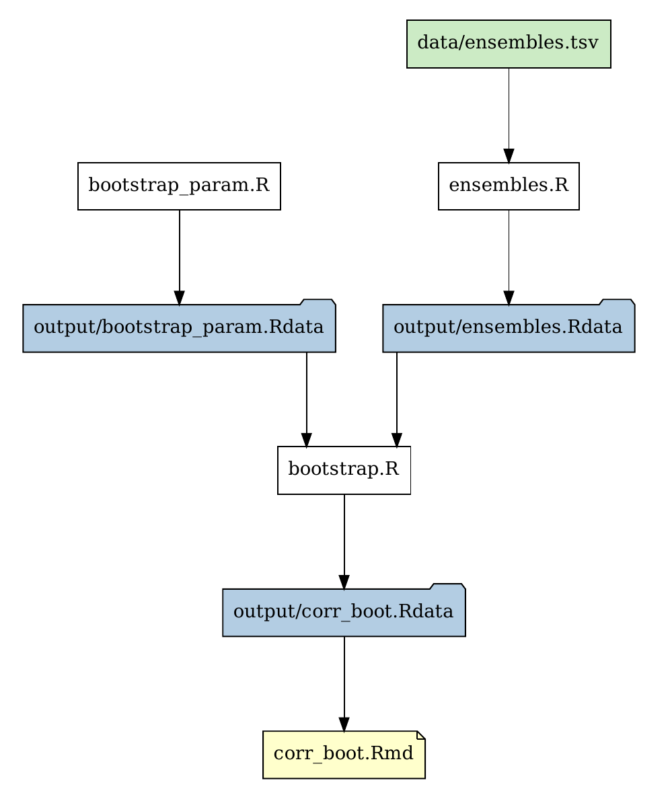

# paramvalf example

This is a somewhat complete example of the paramvalf structure. We have some
data files in `data`, some task snippets in `paramval` and a vignette in
`vignettes`. The actual `.func` functions do not do anything as this is just to
show the structure.

To inialize your paramvalf project you need to do create a file that marks the
root directory.

    touch .paramvalf-root

Then execute the depencency scanner from the R installation once, your path
might vary slightly.

    python3 ~/R/x86_64-redhat-linux-gnu-library/3.5/paramvalf/scan_dependencies.py

From here on you just need to run this:

    ./paramvalf-run .

This will run all the parts of the analysis that needs running. As a side
effects it creates `output/paramvalf-data-flow.pdf`:

It will run all the `paramval/*.R` files in the order that it needs to and
build all the vignettes. If you only want to generate something in particular
you can also execute something like this:

    ./paramvalf-run . output/corr_boot.Rdata

The dependencies are determined by looking for `pv_load('.', …)` and
`pv_save('.', …)` as well as `# Depends:` for auxiliary files. See the files in
`paramval` to see how that loading and saving works exactly.
